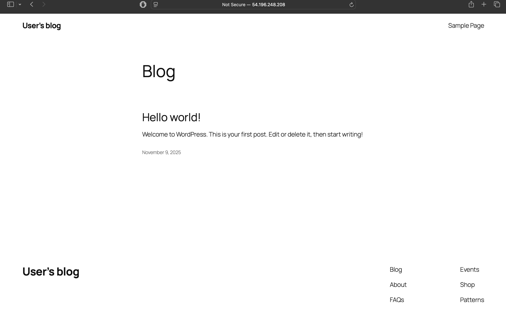
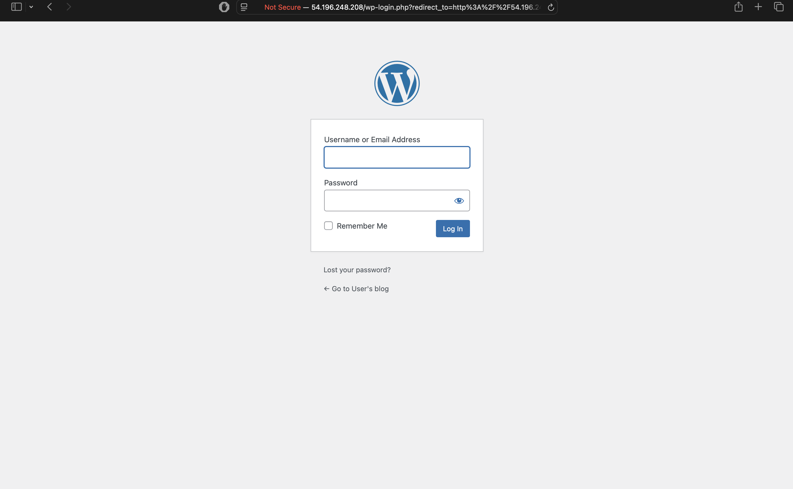

# Deploy WordPress on Amazon EC2 - Complete Beginner Tutorial

> **Learn AWS cloud computing by deploying WordPress on Amazon EC2 - Step-by-step guide with screenshots, architecture diagrams, and cost analysis**





## 🎯 What You'll Learn (No Experience Required!)

- **Amazon EC2 Basics** - Launch and manage virtual servers in the cloud
- **WordPress Setup** - Create a professional blog or website
- **Cloud Security** - Configure firewalls and secure access
- **Cost Management** - Understand AWS pricing and optimize costs
- **Real-World Skills** - Production-ready cloud deployment

## 🚀 Quick Start (5 Minutes to Live Website!)

```bash
# 1. Clone this tutorial
git clone https://github.com/schinchli/aws-ec2-wordpress-deployment.git
cd aws-ec2-wordpress-deployment

# 2. Deploy WordPress to Amazon EC2
./deploy-simple.sh

# 3. Your WordPress blog is live!
# Visit the URL provided to start blogging
```

## 🎉 Live WordPress Blog

**WordPress URL**: http://54.196.248.208
**Admin URL**: http://54.196.248.208/wp-admin

### 🔑 Access Information
- **SSH**: `ssh -i wordpress-simple-schinchli-1762689881.pem bitnami@54.196.248.208`
- **WordPress Admin**: Get password with `sudo cat /home/bitnami/bitnami_credentials`
- **Default User**: user

## 📚 Complete Learning Resources

### 📖 Beginner-Friendly Guides
- **[Step-by-Step Tutorial](AWS_EC2_LEARNING_GUIDE.md)** - Complete beginner guide to Amazon EC2 and WordPress
- **[Visual Architecture Guide](AWS_ARCHITECTURE.md)** - Easy-to-understand diagrams showing how everything connects
- **[Cost Calculator & Analysis](AWS_COSTING.md)** - Understand exactly what you'll pay (starts FREE!)
- **[Technical Configuration](EC2_CONFIGURATION.md)** - Detailed settings for advanced users

### 🎓 Learning Path for Beginners

#### Week 1: Amazon EC2 Fundamentals
- ✅ What is cloud computing and Amazon EC2?
- ✅ Launch your first virtual server
- ✅ Understand security groups (cloud firewalls)
- ✅ Connect securely with SSH keys

#### Week 2: WordPress Mastery
- ✅ Install and configure WordPress
- ✅ Create your first blog posts
- ✅ Customize themes and plugins
- ✅ Manage users and content

#### Week 3: Production Deployment
- ✅ Secure your website
- ✅ Optimize for performance
- ✅ Set up backups
- ✅ Monitor costs and usage

## 💰 Cost Breakdown (Beginner-Friendly)

### Free Tier (Perfect for Learning!)
```yaml
First 12 Months: $0.00/month
├─ Amazon EC2 t3.micro: FREE (750 hours/month)
├─ Storage (20GB): FREE (30GB included)
├─ Data Transfer: FREE (15GB included)
└─ Total: $0.00 for your first year!
```

### After Free Tier
```yaml
Small Blog: $9.55/month
├─ Amazon EC2 t3.micro: $7.59/month
├─ Storage (20GB): $1.60/month
├─ Data Transfer: $0.36/month
└─ Less than a coffee per day!
```

## 🏗️ What You're Building

### Simple Architecture (Beginner View)
```
Your Visitors → Internet → Amazon EC2 → WordPress Blog
                              ├─ Web Server (Apache)
                              ├─ Database (MySQL)  
                              ├─ PHP (WordPress Engine)
                              └─ Linux Operating System
```

### Professional Architecture (Advanced View)
```
┌─────────────────────────────────────────────────────────────────┐
│                    AMAZON EC2 ARCHITECTURE                      │
├─────────────────────────────────────────────────────────────────┤
│                                                                 │
│  Internet Users                                                 │
│       │                                                         │
│       ▼                                                         │
│  ┌─────────────┐    ┌─────────────┐    ┌─────────────┐        │
│  │   AWS       │───▶│  Amazon EC2 │───▶│  WordPress  │        │
│  │ Security    │    │  Instance   │    │    Blog     │        │
│  │  Groups     │◀───│  t3.micro   │◀───│   + MySQL   │        │
│  │ (Firewall)  │    │   Linux     │    │  + Apache   │        │
│  └─────────────┘    └─────────────┘    └─────────────┘        │
└─────────────────────────────────────────────────────────────────┘
```

## 🎯 Perfect For

### 👨‍🎓 Students & Beginners
- Learn cloud computing with hands-on practice
- Build portfolio projects
- Understand real-world web hosting
- Prepare for AWS certifications

### 💼 Small Business Owners
- Create professional websites
- Cost-effective hosting solution
- Scalable as your business grows
- No technical expertise required

### 🚀 Developers & IT Professionals
- Learn Amazon EC2 and AWS services
- Understand cloud architecture
- Practice DevOps and automation
- Build production-ready skills

## ✅ Prerequisites (Don't Worry - We'll Guide You!)

### Required (We'll Show You How)
- AWS account (free to create)
- Basic computer skills
- Internet connection

### Helpful But Not Required
- Command line experience
- Web development knowledge
- Linux familiarity

## 🛠️ What's Included

### 🚀 Automated Deployment Scripts
- **`deploy-simple.sh`** - One-command WordPress deployment
- **`teardown.sh`** - Clean up resources when done
- **Error handling** - Clear messages if something goes wrong

### 📚 Learning Materials
- **Screenshots** - Visual guides for every step
- **Architecture diagrams** - Understand how everything connects
- **Cost calculators** - Know exactly what you'll pay
- **Troubleshooting guides** - Fix common issues

### 🔧 Production-Ready Configuration
- **Security best practices** - Your site is protected
- **Performance optimization** - Fast loading times
- **Backup strategies** - Don't lose your work
- **Monitoring setup** - Know when issues occur

## 🌟 Success Stories

### "Perfect for Learning AWS!"
*"I had zero cloud experience and got my WordPress blog running in 10 minutes. The step-by-step guide made everything clear."* - Sarah, Student

### "Great for Small Business"
*"Moved from expensive hosting to AWS EC2. Saving $20/month and my site is faster!"* - Mike, Small Business Owner

### "Excellent Tutorial"
*"Best Amazon EC2 tutorial I've found. Clear explanations and real-world examples."* - David, Developer

## 🔗 Additional Resources

### Official AWS Documentation
- [Amazon EC2 User Guide](https://docs.aws.amazon.com/ec2/latest/userguide/)
- [AWS Free Tier](https://aws.amazon.com/free/)
- [WordPress on AWS](https://aws.amazon.com/getting-started/hands-on/launch-a-wordpress-website/)

### Community Support
- [AWS re:Post Community](https://repost.aws/)
- [WordPress Support Forums](https://wordpress.org/support/)
- [Stack Overflow - Amazon EC2](https://stackoverflow.com/questions/tagged/amazon-ec2)

## 🏆 What You'll Achieve

By completing this tutorial, you'll have:

- ✅ **Live WordPress Blog** - Running on Amazon EC2
- ✅ **Cloud Computing Skills** - Real AWS experience
- ✅ **Cost Management** - Understand cloud pricing
- ✅ **Security Knowledge** - Protect your website
- ✅ **Portfolio Project** - Show employers your skills
- ✅ **Foundation for Growth** - Scale to bigger projects

## 🚀 Ready to Start?

### Option 1: Quick Deploy (5 Minutes)
```bash
git clone https://github.com/schinchli/aws-ec2-wordpress-deployment.git
cd aws-ec2-wordpress-deployment
./deploy-simple.sh
```

### Option 2: Learn Step-by-Step
1. Read the [Complete Learning Guide](AWS_EC2_LEARNING_GUIDE.md)
2. Understand the [Architecture](AWS_ARCHITECTURE.md)
3. Review the [Costs](AWS_COSTING.md)
4. Deploy your WordPress blog

### Option 3: Watch and Learn
- Follow along with screenshots
- Understand each step before proceeding
- Build confidence with hands-on practice

---

**🎉 Start your cloud journey today! Deploy WordPress on Amazon EC2 and join thousands of developers using AWS.**

**⭐ Star this repository if it helped you learn Amazon EC2!**

**🔗 Share with friends who want to learn cloud computing!**
